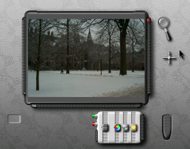
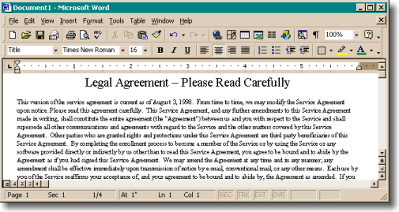
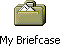
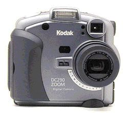
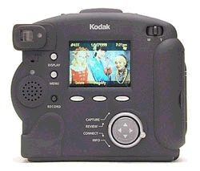
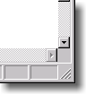
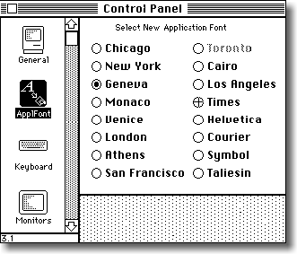
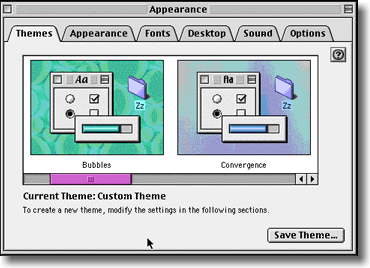

+++
title = "Affordances and Metaphors"
weight = 40
+++

Developing a user interface where the program model matches the user model is not easy. Sometimes, your users might not _have_ a concrete expectation of how the program works and what it's supposed to do. In these cases, you are going to have to find ways to give the user clues about how something works. With graphical interfaces, a common way to solve this problem is with _metaphors_. But not all metaphors are created equal, and it's important to understand _why_ metaphors work so you know if you've got a good one.

The most famous metaphor is the "desktop metaphor" used in Windows and the Macintosh. You have these little folders with little files in them, which you can drag around. You can drag a file from one folder to another to move it. To the extent that this metaphor works, it's because the little pictures of folders actually remind people of folders, which makes them realize that they can put documents into them.

Here's a screenshot from Kai's Photo Soap. Can you guess how to zoom in?

It's not very hard. The magnifying glass is a real world metaphor. People know what they are supposed to do. And there's no fear that the zoom operation is actually changing the size of the underlying image, since that's not what magnifying glasses do.

A metaphor, even an imperfect one, works a lot better than when you don't have one at all. Can you figure out how to zoom in with Microsoft Word?

Word has two tiny magnifying glasses in their interface, but one of them is on the "Print Preview" button (for some reason), and the other is on the "Document Map" button, whatever that is. The actual way to change the zoom level here is with the dropdown box that is currently showing "100%". There's no attempt at a metaphor, so it's harder for users to guess how to zoom. This is not necessarily a bad thing; zooming is probably not important enough in a word processing application to justify as much screen space as Kai gives it. But it's a safe bet that more Kai users will be able to zoom in than Word users.

A metaphor, badly chosen, is worse than no metaphor at all. Remember the briefcase from Windows 95? This cute little icon occupied a square inch or so on everybody's desktop for a few years until Microsoft realized that nobody wanted one. And nobody wanted one, because it was a broken metaphor. It was supposed to be a "briefcase", where you put files to take home. But when you took the files home, you still had to put them on a floppy disk. So, do you put them in the briefcase or on a floppy disk? I'm not sure. I don't understand the briefcase. I could never get it to work.

### **Affordances **

Well-designed objects make it clear how they work just by looking at them. Some doors have big metal plates at arm-level. The only thing you can do to a metal plate is push it. In the words of Donald Norman, the plate _affords_ pushing. Other doors have big, rounded handles that just make you want to _pull_ them. They even imply how they want you to place your hand on the handle. The handle _affords_ pulling. It makes you _want_ to pull it.

Other objects aren't designed so well and you can't tell what you're supposed to do. The quintessential example is the CD jewel case, which requires you to place your thumbs _just so_ and pull in a certain direction. Nothing about the design of the box would indicate how you're supposed to open it. If you don't know the trick, it's very frustrating, because the box just won't open.

The best way to create an affordance is to echo the shape of the human hand in "negative space". Look closely at the (excellent) Kodak DC-290 digital camera, shown here front and back:

On the front, you can see a big rubber grip which just looks like your right fingers fit there. Even smarter, on the back, in the lower left corner, you can see an indent which looks uncannily like a thumbprint. When you put your left thumb there, your left index finger curls snugly on the front of the camera, between the lens and another rubber nubbin. It provides a kind of comforting feeling you haven't felt since you sucked your thumb (and curled your index finger around your nose)

The Kodak engineers are just trying to persuade you to hold the camera with both hands, in a position which ensures that the camera will be more stable and even keeps stray fingers from blocking the lens by mistake. All this rubber is not functional, its sole purpose is to encourage you to hold the camera correctly.

Good computer UI uses affordances, too. About ten years ago, most push buttons went "3D". Using shades of grey, they appear to pop out of the screen. This is not just to look cool: it's important because 3D buttons _afford_ pushing. They look like they stick out and they look like the way to operate them is by clicking on them. Unfortunately, many web sites these days (unaware of the value of affordances) would rather have buttons that look _cool_ rather than buttons which look _pushable_; as a result, you sometimes have to hunt around to figure out where to click. Look at this web banner:

The "Go" and "Login" buttons pop out and _look_ like you can click on them. The Site Map and Help buttons don't look so clickable, in fact, they look exactly like the QUOTES label which _isn't_ clickable.

About four years ago, many windows started sprouting three little ridges on the bottom right corner which look like a grip. It looks like the kind of thing somebody would put on a slide switch to increase the friction. It _affords_ dragging. It just _begs_ to be dragged to stretch the window.

Finally, one of the best examples of affordances is the famous "tabbed dialog". Remember the old Mac control panel?

The idea was that you choose one of the icons from the (scrolling) list on the left. As you click on the icon, the right side of the screen changes. For some reason, this type of indirection was incredibly logical to the programmers who designed it, but many users didn't understand it. Among other things, people rarely figured out how to scroll the list to get more than the first 4 control panels. But more critically, most people just didn't understand that there was a connection between the icons and the dialog. The icons actually look like they are one of the choices.

Starting in about 1992, these interfaces started to disappear, to be replaced with a new invention called tabbed dialogs:

Tabbed dialogs are a great affordance. It's really _obvious_ from this picture that you have six tabs; it's really _obvious_ which tab you're on, and it's really _obvious_ how to switch to a different tab. When Microsoft first usability tested the tabbed dialog interface, usability went up from about 30% (the old Mac way) to 100%. Literally every single testee was able to figure out the tabbed dialogs. Given the remarkable success of this metaphor, and the fact that the code for tabbed dialogs is built into Windows and available practically for free, it's a wonder you still see applications which don't take advantage of them. These applications suffer from actual, measurable, real world usability problems because they refuse to get with the program.
