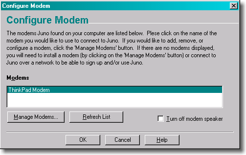
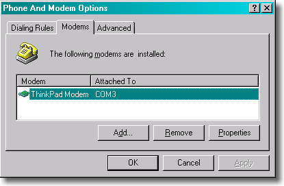
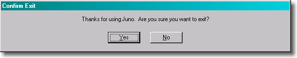
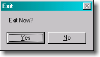

+++
title = "Designing for People Who Have Better Things To Do With Their Lives"
weight = 60
+++

When you design user interfaces, it's a good idea to keep two principles in mind:

1. Users don't have the manual, and if they did, they wouldn't read it.
2. In fact, users can't read anything, and if they could, they wouldn't want to.

These are not, strictly speaking, _facts_, but you should act as if they are facts, for it will make your program easier and friendlier. Designing with these ideas in mind is called _respecting the user_, which means, not having much respect for the user. Confused? Let me explain.

What does it mean to make something _easy to use_? One way to measure this is to see what percentage of real-world users are able to complete tasks in a given amount of time. For example, suppose the goal of your program is to allow people to convert digital camera photos into a web photo album. If you sit down a group of average users with your program and ask them all to complete this task, then the more _usable_ your program is, the higher the percentage of users that will be able to successfully create a web photo album. To be scientific about it, imagine 100 real world users. They are not necessarily familiar with computers. They have many diverse talents, but some of them distinctly do *not *have talents in the computer area. Some of them are being distracted while they try to use your program. The phone is ringing. WHAT? The baby is crying. WHAT? And the cat keeps jumping on the desk and batting around the mouse. I CAN'T HEAR YOU!

Now, even without going through with this experiment, I can state with some confidence that some of the users will simply fail to complete the task, or will take an extraordinary amount of time doing it. I don't mean to say that these users are _stupid_. Quite the contrary, they are probably highly intelligent, or maybe they are accomplished athletes, but vis-à-vis _your program_, they are just not applying all of their motor skills and brain cells to the usage of your program. You're only getting about 30% of their attention, so you have to make do with a user who, from inside the computer, does not appear to be playing with a full deck.

> Users Don't Read the Manual.

First of all, they actually don't _have_ the manual. There may not _be_ a manual. If there is one, the user might not have it, for all kinds of logical reasons: they're on the plane; they are using a downloaded demo version from your web site; they are at home and the manual is at work; their IS department never _gave_ them the manual. Even if they have the manual, frankly, they are simply not going to read it unless they absolutely have no other choice. With _very_ few exceptions, users will not cuddle up with your manual and read it through before they begin to use your software. In general, your users are trying to get something _done_, and they see reading the manual as a waste of time, or at the very least, as a distraction that keeps them from getting their task done.

The very fact that you're reading this book puts you in an elite group of highly literate people. Yes, I know, people who use computers are by and large _able_ to read, but I guarantee you that a good percentage of them will find reading to be a chore. The language in which the manual is written may not be their first language, and they may not be totally fluent. They may be kids! They can decipher the manual if they really _must_, but they sure ain't gonna read it if they don't have to Users do just-in-time manual reading, on a strictly need-to-know basis.

The upshot of all this is that you probably have no choice but to design your software so that it does not need a manual in the first place. The only exception I can think of is if your users do not have any _domain knowledge_ - they don't really understand what the program is intended to do, but they know that they better learn. A great example of this is Intuit's immensely popular small-business accounting program QuickBooks. Many of the people who use this program are small business owners who simply have no idea what's involved in accounting. The manual for QuickBooks assumes this and assumes that it will have to teach people basic accounting principles. There's no other way to do it. Still, if you do know accounting, QuickBooks is easy to use without the manual.

> In fact, users don't read _anything_

This may sound a little harsh, but you'll see, when you do usability tests, that there are quite a few users who simply do not read words that you put on the screen. If you pop up an error box of any sort, they simply will not read it. This may be disconcerting to you as a programmer, because you imagine yourself as conducting a _dialog_ with the user. Hey, user! You can't open that file, we don't support that file format! Still, experience shows that the more words you put on that dialog box, the fewer people will actually read it.

The fact that users do not read the manual leads many software designers to assume that they are going to have to educate users by describing things as they go along. You see this all over the place in programs. In principle, it's OK, but in reality, people's aversion to reading means that this will almost always get you in trouble. Experienced UI designers literally try to minimize the number of words on dialogs to increase the chances that they will get read. When I worked on Juno, the UI people understood this principle and tried to write short, clear, simple text. Sadly, the CEO of the company had been an English major at an Ivy League college; he had no training in UI design or software engineering, but he sure _thought_ he was a good editor of prose. So he vetoed the wording done by the professional UI designers and added lots of his own verbiage. A typical dialog in Juno looks like this:

Compare that to the equivalent dialog from Windows:

Intuitively, you might guess that the Juno version, with 80 words of instructions, would be "superior" (i.e., easier to use) than the Windows version, with 5 words of instructions. In reality, when you run a usability test on this kind of thing, you'll find that

-   advanced users skip over the instructions. They assume they know how to use things and don't have time to read complicated instructions
-   most novice users skip over the instructions. They don't like reading too much and hope that the defaults will be OK
-   the remaining novice users who do, earnestly, try to read the instructions (some of whom are only reading them because it's a usability test and they feel obliged) are often confused by the sheer number of words and concepts. So even if they were pretty confident that they would be able to use the dialog when it first came up, the instructions actually _confused them even more_.

Now, Juno was obviously micro-managed beyond all reason. More to the point, if you're an English major from Columbia, then you are in a whole different _league_ of literacy than the average Joe, and you should be very careful about wording dialogs that look helpful to you. Shorten it, dumb it down, simplify, get rid of the complicated clauses in parentheses, and usability test. But do _not_ write things that look like Ivy League faculty memos. Even adding the word "please" to a dialog, which may seem helpful and polite, is going to slow people down: the increased bulk of the wording is going to reduce, by some measurable percentage, the number of people who read the text.

Another important point is that **many people are intimidated by computers **. You probably know this, right? But you may not realize the implications of this. I was watching a friend try to exit Juno. For some reason she was having quite a bit of trouble. I noticed that when you try to exit Juno, the following dialog pops up:

She was hitting **No **, and then she was kind of surprised that Juno hadn't exited. The very fact that Juno was questioning her choice made her immediately assume that she was doing something wrong. Usually, when programs ask you to confirm a command, it's because you're about to do something which you might regret. She had assumed that if _the computer_ was questioning her judgment, then _the computer_ must have been right, because, after all, computers are _computers_ where as she was merely a _human_, so she hit "No."

Is it too much to ask people to read 11 lousy words? Well, apparently. First of all, since exiting Juno has no deleterious effects, Juno should have just exited without prompting for confirmation, like every other GUI program in existence. But even if you are _convinced_ that it is _crucial_ that people confirm before exiting, you could do it in two words instead of 11:

Without the completely unnecessary "thank you" and the remorse-inspiring "are you _sure?_", this dialog is a lot less likely to cause problems. Users will certainly read the two words, say "um, duh?" to the program, and pound the Yes key.

Sure, the Juno Exit Confirmation dialog trips up a _few_ people, you say, but is it _that_ big a deal? Everyone will *eventually *manage to get out of the program. But herein lies the difference between a program which is _possible_ to use versus a program which is _easy_ to use. Even smart, experienced, advanced users will appreciate things that you do to make it easy for the distracted, inexperienced, beginner users. Hotel bathtubs have big grab bars. They're just there to help disabled people, but everybody uses them anyway to get out of the bathtub. They make life easier even for the physically fit.

In the next chapter, I'll talk a bit about the mouse. Just like users don't/won't/can't read, some are not very good at using the mouse, so you have to accommodate them.
