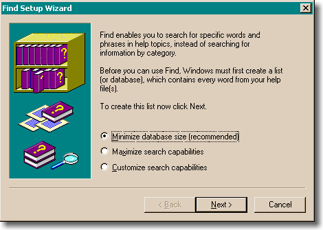
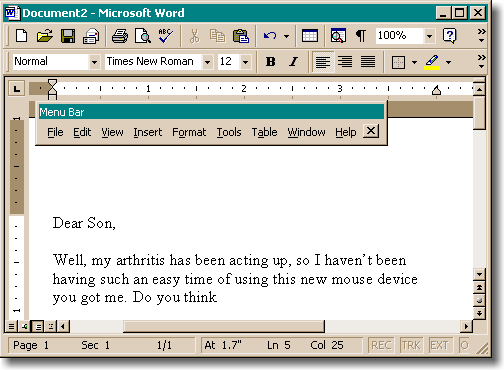

title = "Chapter 3: Choices"
+++
When you go into a restaurant and you see a sign that says "No Dogs Allowed," you might think that sign is purely proscriptive: Mr. Restaurant doesn't like dogs around, so when he built the restaurant he put up that sign.

If that was *all* that was going on, there would also be a "No Snakes" sign; after all, nobody likes snakes. And a "No Elephants" sign, because they break the chairs when they sit down.

The *real* reason that sign is there is historical: it is a historical marker that indicates that people used to try to bring their dogs into the restaurant.

Most prohibitive signs are there because the proprietors of an establishment were sick and tired of people doing X, so they made a sign asking them to please *not*. If you go into one of those fifty year old ma-and-pa diners, like the Yankee Doodle in New Haven, the walls are *covered* with signs saying things like "Please don't put your knapsack on the counter," more anthropological evidence that people used to put their knapsacks on the counter a lot. By the age of the sign you can figure out when knapsacks were popular among local students

Sometimes they're harder to figure out. "Please do not bring glass bottles into the park" must mean that somebody cut themselves stepping on broken glass while walking barefoot through the grass once, and it's a good bet they sued the city.

Software has a similar archaeological record, too: it's called the Options dialog. Pull up the Tools | Options dialog box and you will see a history of arguments that the software designers had about the design of the product. Should we automatically open the last file that the user was working on? Yes! No! There is a two week debate, nobody wants to hurt anyone's feelings, the programmer puts in an #ifdef in self defense while the designers fight it out. Eventually they just decide to make it an option.

It doesn't even have to be a debate between two people: it can be an internal dilemma. I just *can't decide* if we should optimize the database for size or speed. Either way, you wind up with things like what is unequivocally the most moronic "wizard" dialog in the history of the Windows operating system. This dialog is so stupid that it deserves some kind of award. A whole new *category* of award. It's the dialog that comes up when you try to find something in Help:

The first problem with this dialog is that it's distracting. You are trying to find help in the help file. You do not, at that particular moment, give a hoot whether the database is small, big, customized, or chocolate-covered. In the meanwhile, this wicked, wicked dialog is giving you little pedantic lectures that it must create a list (or database). There are about three paragraphs there, most of which are completely confusing. There's the painfully awkward phrase "your help file(s)". You see, you may have *one or more* files. As if you  **cared ** at this point that there could be more than one. As if it made the slightest amount of difference. But the programmer who worked on that dialog was obviously distressed beyond belief at the possibility that there might be more than one help file(s) and it would be incorrect to say help file, now, wouldn't it?

Don't even get me started about how most people who want help are not the kinds of people who understand these kinds of arcana. Or that even advanced users, programmers with PhDs in Computer Science who know *all about* full text indexes, would not be able to figure out what they are really being asked to choose from

To add insult to injury, this isn't even a dialog... it's a *wizard* (the second page of which just says something like "thank you for submitting yourself to this needless waste of your time," to paraphrase). And it's pretty obvious that the designers had *some* idea as to which choice is best; after all, they've gone to the trouble of recommending one of the choices.

Which brings us to our second major rule of user interface design:

> Every time you provide an option, you're asking the user to make a decision.

Asking the user to make a decision isn't *in itself* a bad thing. Freedom of choice can be wonderful. People *love* to order espresso-based beverages at Starbucks because they get to make so many *choices*. Grande-half-caf-skim-mocha-Valencia-with-whip. Extra hot!

The problem comes when you ask them to make a choice that *they don't care about*. In the case of help files, people are looking at the help file because they are having trouble accomplishing something they *really want to accomplish*, like making a birthday invitation. Their birthday invitation task has been unfortunately interrupted because they can't figure out how to print upside down balloons, or whatever, so they are going to the help file. Now, some annoying help-index-engine-programmer at Microsoft with an inflated idea of his own importance to the whole scheme of things has the *audacity*, the *chutzpah*, to interrupt the user *once again* and start teaching the user things about making lists (or databases). This second level of interrupting is completely unrelated to birthday invitations, and it's simply guaranteed to perplex and eventually piss off the user.

And believe you me, users care about a lot less things than you might think. They are using your software to accomplish a task. They care about the task. If it's a graphics program, they probably want to be able to control *every pixel* to the finest level of detail. If it's a tool to build a web site, you can bet that they are obsessive about getting the web site to look exactly the way they want it to look.

They do *not*, however, care one whit if the program's own toolbar is on the top or the bottom of the window. They don't care how the help file is indexed. They don't care about a lot of things, and it is the designers' responsibility to make these choices for them so that they don't have to. It is the height of arrogance for a software designer to inflict a choice like this on the user simply because the designer couldn't think hard enough to decide which option is really better. (It's even worse when you try to cover up the fact that you're giving the user a difficult choice by converting it to a wizard, as the WinHelp people did. As if the user was a moron who needed to take a little two step mini-course in the choice that they are being offered so that they can make an *educated* decision.)

It has been said that design is the art of *making choices*. When you design a trash can for the corner, you have to make choices between conflicting requirements. It needs to be heavy so it won't blow away. It needs to be light so the trash collector can dump it out. It needs to be large so it can hold a lot of trash. It needs to be small so it doesn't get in peoples' way on the sidewalk. When you are designing, and you try to abdicate your responsibility by forcing the user to decide something, you're probably not doing your job. Someone else will make an easier program that accomplishes the same task with less intrusions, and most users will love it.

When Microsoft Excel 3.0 came out in 1990, it was the first application to sport a new feature called a toolbar. It was a sensible feature, people liked it, and everybody copied it - to the point that it's unusual to see an application without one any more.

The toolbar was so successful that the Excel team did field research using a special version of Excel which they distributed to a few people; this version kept statistics on what the most frequently used commands were and reported them back to Microsoft. For the next version, they added *another* row of toolbar buttons, this time containing the most frequently used commands. Great.

The trouble was, they never got around to disbanding the toolbar team, who didn't seem to know when to leave good enough alone. They wanted you to be able to *customize* your toolbar. They wanted you to be able to drag the toolbar anywhere on the screen. Then, they started to think about how the menu bar is really just a glorified toolbar with words instead of icons, so they let you drag the *menu bar *anywhere you wanted on the screen, too. Customizability on steroids. Problem: nobody cares! I've never met anyone who wants their menu bar anywhere except at the top of the window. But here's the (bad) joke: if you try to pull down the File menu, and you accidentally grab the menu bar a tiny bit too far to the left, you yank off the whole menu bar, dragging it to the only place you could not possibly want it to be: blocking the document you're working on.

How many times have you seen *that*? And once you've done this by mistake, it's not clear what you did or how to fix it. So here we have an option (moving the menu bar) that nobody wants (ok, maybe 0.1% of all humans want it) but which gets in the way for almost everybody.

One day a friend called me up. She was having trouble sending email. Half the screen was grey, she said

Half the screen was grey?

It took me five minutes over the phone to figure out what had happened. She had accidentally dragged the Windows toolbar to the right side of the screen, then accidentally widened it:

This is the kind of thing that nobody does *on purpose*. And there are a lot of computer users out there who can't get themselves out of this kind of mess; by definition, when you accidentally reconfigure one of the options in your program, you don't know how to re-reconfigure it. It's sort of shocking how many people uninstall and then reinstall their software when things start behaving wrong, because at least they know how to do that. (They've learned to uninstall first, because otherwise all the broken customizations are likely to just come back).

"But wait!" you say. "It's important to have options for *advanced* users who want to tweak their environments!" In reality, it's not as important as you think. This reminds me of when I tried to switch to a Dvorak keyboard. The trouble was, I don't use *one* computer. I use all kinds of computers. I use other people's computers. I use three computers fairly regularly at home and three at work. I use computers in the test lab at work. The trouble with customizing your environment is that it just doesn't *propagate*, so it's not even worth the trouble.

Most advanced users use several computers regularly; they upgrade their computer every couple of years, they reinstall their operating system every three weeks. It's true that the *first* time they realized you could completely remap the keyboard in Word, they changed everything around to be more to their liking, but as soon as they upgraded to Windows 95 those settings got lost, and they weren't the same at work, and eventually they just stopped reconfiguring things. I've asked a lot of my "power user" friends about this; hardly any of them do any customization other than the bare minimum necessary to make their system behave reasonably.

 **Every time you provide an option, you're asking the user to make a decision. ** That means they will have to think about something and decide about it. It's not necessarily a *bad* thing, but, in general, you should always try to minimize the number of decisions that people have to make.

This doesn't mean eliminate *all* choice. There are enough choices that users will have to make anyway: the way their document will look, the way their web site will behave, or anything else that is integral to the work that the user is doing. In these areas, go crazy:  it's great to give people choices: by all means, the more the merrier. And there's another category of choice that people like: the ability to change the visual look of things, without really changing the behavior. Everybody loves WinAmp skins; everybody sets their desktop background to a picture. Since the choice affects the visual look without affecting the way anything functions, and since users are completely free to ignore the choice and get their work done anyway, this is a good use of options.
