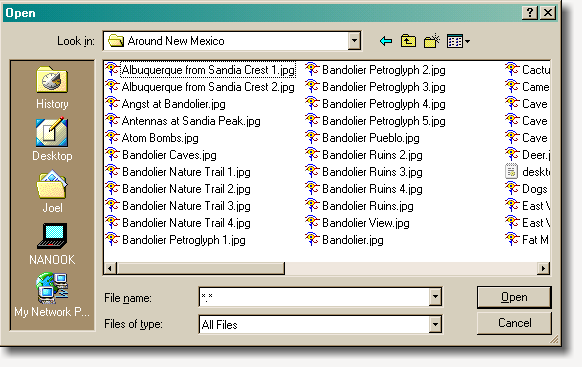
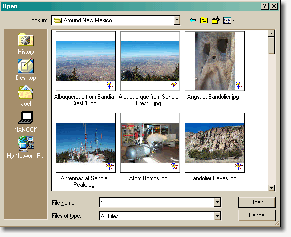

title = "Chapter 8: Designing for People Who Have Better Things To Do With Their Lives, Part Three"
+++
One of the early principles of GUI interfaces was that you shouldn't ask people to remember things that the computer could remember. The classic example is the Open File dialog box, which shows people a list of files rather than asking them to recall and type the exact file name. People remember things a lot better when they are given some clues, and they'd always rather choose something from a list than have to recall it from memory

Another example is the menus themselves. Historically, providing a complete menu of available commands replaced the old command-line interfaces, where you had to memorize the commands you wanted to use. And this is, fundamentally, the reason why command line interfaces are just  **not ** better than GUI interfaces, no matter what your UNIX friends tell you. Using a command line interface is like having to learn Korean to order food in a Seoul branch of McDonalds. Using a menu based interface is like being able to point to the food you want and nod your head vigorously: it conveys the same information with no learning curve.

Consider the file selection process in a typical graphics program:

 Luckily, Windows 98 introduced thumbnail support, so you can see the files like this:

This makes it significantly easier to open the file you want; it doesn't even take the mental effort to map words onto pictures.

You can see the minimum-memory principle at work in features like auto completion, too. Even if you need to type something, some programs make educated guesses about what you're about to type:

In this example, as soon as you type "M", Excel guesses that you are likely to be typing Male, because you've typed Male before in this column, and proposes that as the auto completion. But the "ale" is *preselected* so that if you didn't *mean* to type Male, you can keep typing (perhaps "ystery") and overwrite Excel's guess with no lost effort.

Microsoft Word gets a little bit carried away guessing what you are about to type, as anybody that has ever used that product during the merry month of May has discovered:

### Designing For People Who Have Better Things To Do With Their Lives, Redux
In the preceding chapters, I've brought up three principles:

* Users don't read stuff ([chapter 6](chapter6.html))
* Users can't use the mouse ([chapter 7](chapter7.html))
* Users can't remember anything

You might be starting to get the impression that I think that users are dolts. It's not true. Disrespecting your users is how arrogant software like Microsoft Bob gets created (and dumped in the trash bin), and nobody is very happy.

On the other hand, there is a much worse kind of arrogance in software design: the arrogant assumption that "my software is so damn cool, people are just going to have to warp their brains around it." This kind of *chutzpah* is pretty common in the free software world. Hey, Linux is free! If you're not smart enough to decipher it, you don't deserve to be using it!

Human aptitude tends towards the bell curve. Maybe 98% of your customers are smart enough to use a television set. About 70% of them can use Windows. 15% can use Linux. 1% can program. But only 0.1% of them can program in a language like C++. And only 0.01% of them can figure out Microsoft ATL programming. (And all of them, without exception, have beards and glasses.)

The effect of this sharp drop-off is that whenever you "lower the bar" by even a small amount, making your program, say, 10% easier to use, you *dramatically* increase the number of people who can use it, say, by 50%.

So, I don't really believe that people are dolts, but I think that if you constantly try to design your program so that it's easy enough for dolts to use, you are going to make a popular, easy to use program that people like. And you will be surprised by how what seem like small usability improvements translate into lots more customers.

One good way to evaluate the usability of a program or dialog you've never seen before is to act a little stupid. Don't read the words on the dialog. Make random assumptions about what things do without verifying. Try to use the mouse with just one finger. Make lots of mistakes, and generally thrash around. See if the program does what you want, or at least, gently guides you instead of blowing up. Be impatient. If you can't do what you want right away, give up. If the UI can't withstand your acting generally immature and stupid, it could use some work.
